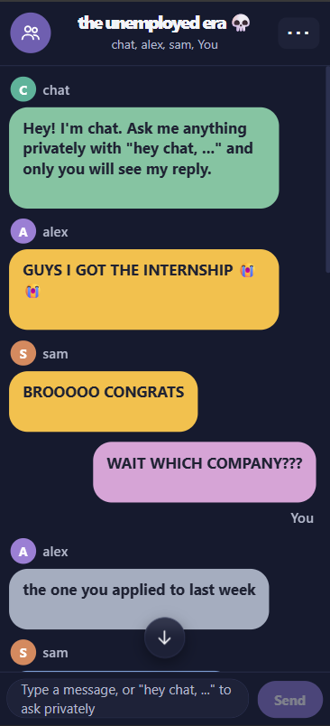
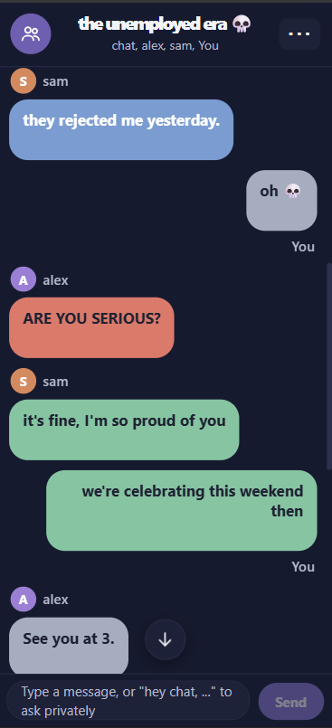
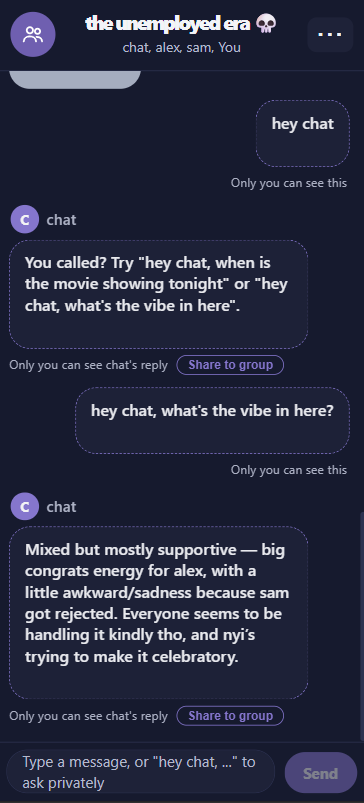
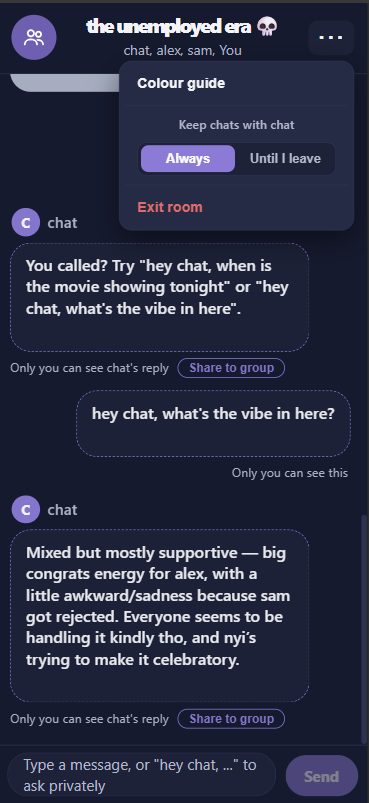
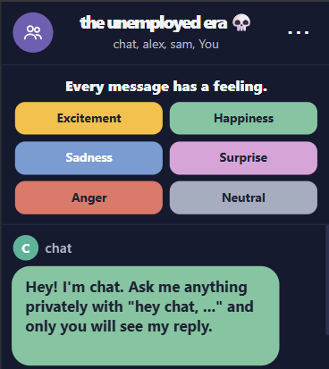

# Vibe Chat

[](https://app.codacy.com/gh/nyinyioo/sentiment-analysis-chatapp/dashboard)
[](https://app.codacy.com/gh/nyinyioo/sentiment-analysis-chatapp/dashboard)

Vibe Chat is a real-time group messaging application that combines AI-powered assistance with sentiment analysis to make conversations more interactive and expressive.

## Whisper

Whisper is a private AI assistant built into group chats, allowing users to ask questions, explore conversations, and share AI-generated responses when they choose.


### What makes Whisper interesting?

<p align="center">
  
  &nbsp;
  
  &nbsp;
  
  &nbsp;
  
</p>

<table width="90%" align="center">
  <tr>
    <td align="center" width="25%">
      <strong>Private AI</strong>
      <br />
      <sub>Ask questions privately.</sub>
    </td>
    <td align="center" width="25%">
      <strong>Conversation Memory</strong>
      <br />
      <sub>Continue with previous context.</sub>
    </td>
    <td align="center" width="25%">
      <strong>Share When You Want</strong>
      <br />
      <sub>Choose what to share.</sub>
    </td>
    <td align="center" width="25%">
      <strong>Privacy Controls</strong>
      <br />
      <sub>Temporary or saved chats.</sub>
    </td>
  </tr>
</table>


<br>


## Sentiment Analysis

**Every message has a feeling. Now it has a vibe.**

<table width="90%" align="center">
  <tr>
    <td width="35%" align="center" valign="middle">
      
    </td>
    <td width="65%" valign="middle">
      Vibe Chat assigns each message to one of six emotional categories, each represented by a distinct color.
      <br /><br />
      <strong>Excitement · Happiness · Sadness · Surprise · Anger · Neutral</strong>
      <br /><br />
      Bring conversations to life with vibrant, expressive, color-coded messages.
    </td>
  </tr>
</table>

<br>


<br />

## MCP Extensions

Whisper can be extended through the Model Context Protocol (MCP) to connect with external tools and services, bringing AI-powered assistance beyond group messaging.

<table width="90%" align="center">
  <tr>
    <td width="33%" align="center" valign="top">
      
      <br /><br />
      <strong>Google Calendar</strong>
      <br /><br />
      <sub>Coordinate meetings, check availability, and manage events through Whisper.</sub>
    </td>
    <td width="33%" align="center" valign="top">
      
      <br /><br />
      <strong>Notion</strong>
      <br /><br />
      <sub>Turn group discussions into organized notes, summaries, and project tasks.</sub>
    </td>
    <td width="33%" align="center" valign="top">
      
      <br /><br />
      <strong>Google Drive</strong>
      <br /><br />
      <sub>Find project documents and summarize relevant information within conversations.</sub>
    </td>
  </tr>
</table>

<sub><em>Planned integrations — not yet implemented.</em></sub>

<br />


## Tech Stack

| Component | Technology |
|---|---|
| Frontend | React |
| Backend | Node.js, Express |
| Database | MongoDB |
| AI Assistant | OpenAI GPT API |
| Machine Learning & NLP | Python, FastAPI, Hugging Face, Rasa |
| Testing | Jest, pytest, Vitest |

The application uses the OpenAI GPT API to power its AI assistant. Rasa NLU training is still a work in progress.

<br>

## Set-Up Instructions

### Prerequisites

- Python
- Node.js and npm
- MongoDB
- OpenAI API key

### Installation

```bash
# Clone the repository
git clone <repo-url>
cd sentiment-analysis-chatapp

# Set up Python environment
python -m venv venv
source venv/bin/activate
pip install -r backend/requirements.txt

# Install backend dependencies
cd backend/app
npm install

# Install frontend dependencies
cd ../../frontend-react
npm install

# Start the application
cd ..
./scripts/start.sh
```


## Testing

Unit tests are implemented across the application.

| Component | Framework |
|---|---|
| Backend | Jest |
| Python ML module | pytest |
| Frontend | Vitest |

### Run Tests

```bash
# Node.js tests
cd backend/app && npm test

# Python tests
source venv/bin/activate
cd backend/ml && pytest -v

# React tests
cd frontend-react && npm test
```